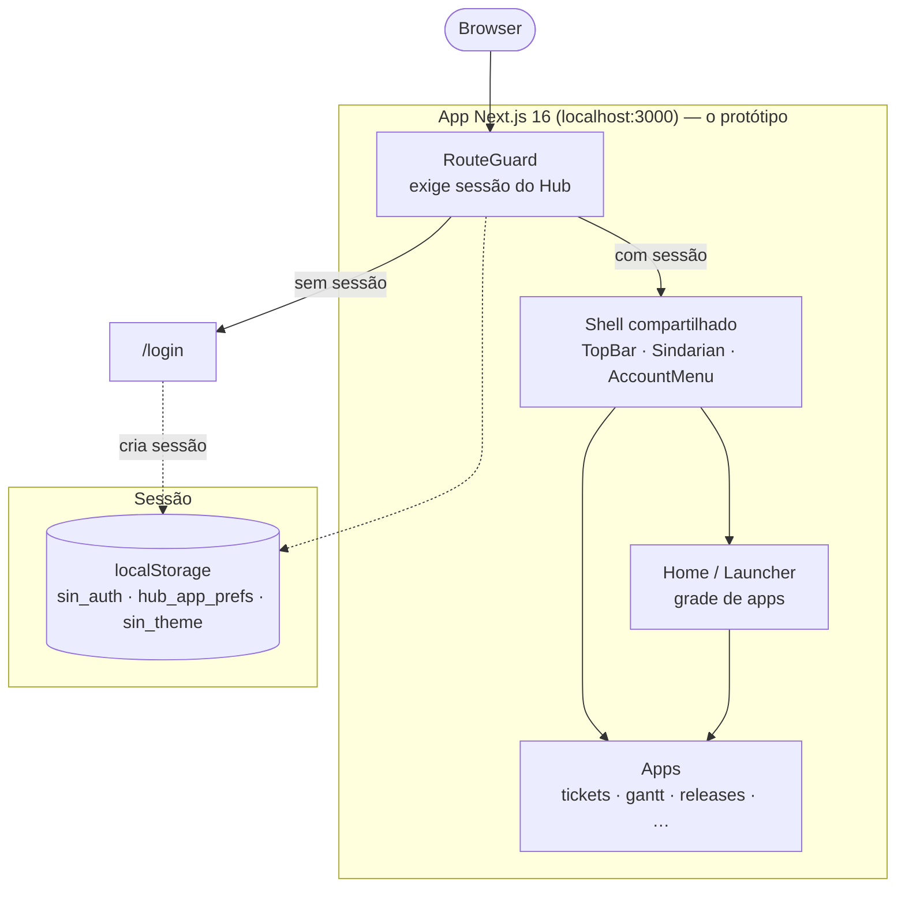
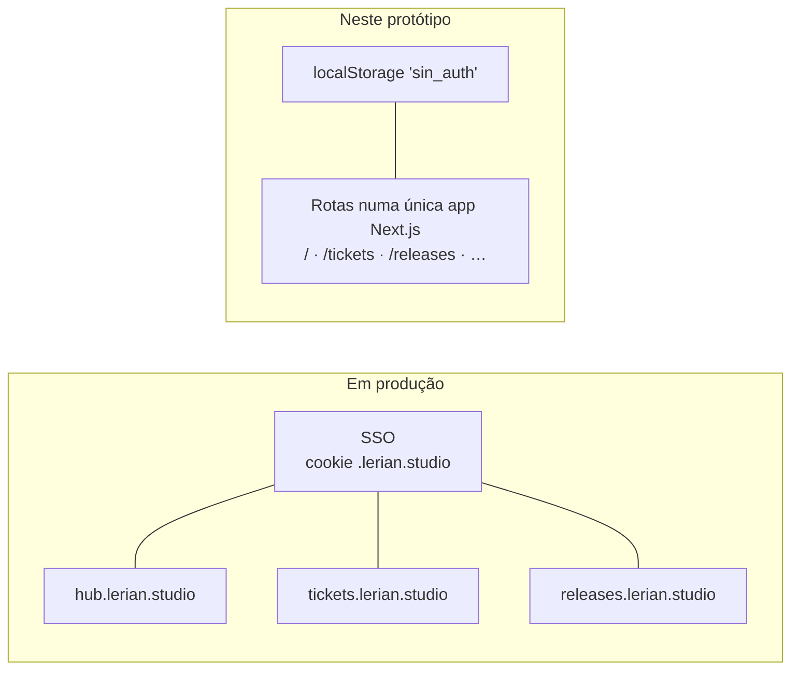

<p align="center">
  
</p>

<p align="center">
  
  
  
  
  
  
</p>

<p align="center">
  <strong>Protótipo navegável da <em>Opção A</em> para o portal unificado da Lerian: um shell fino compartilhado + SSO único + apps independentes, cada um em seu próprio subdomínio.</strong>
</p>

<p align="center">
  <a href="#-visão-geral">Visão Geral</a> &bull;
  <a href="#-como-rodar">Como Rodar</a> &bull;
  <a href="#-arquitetura">Arquitetura</a> &bull;
  <a href="#-rotas">Rotas</a> &bull;
  <a href="#-home-customizável">Home</a> &bull;
  <a href="#-stack">Stack</a>
</p>

---

## Table of Contents

<details>
<summary>Expandir</summary>

- [Visão Geral](#-visão-geral)
- [Como Rodar](#-como-rodar)
- [Arquitetura](#-arquitetura)
- [Rotas](#-rotas)
- [Home Customizável](#-home-customizável)
- [Estrutura](#-estrutura)
- [Stack](#-stack)
- [Notas](#-notas)

</details>

---

## &#x2728; Visão Geral

A ideia central: em vez de um monólito que troca telas via `<div>`, cada app é um **deploy separado no seu próprio subdomínio**. O único elo entre eles é uma **barra-shell compartilhada** e uma **sessão SSO única**. Em produção, navegar entre apps seria um page load real para outro subdomínio; aqui usamos uma única aplicação Next.js para demonstrar a experiência ponta a ponta.

> Reconstrução do protótipo estático (HTML/CSS/JS) como uma **app Next.js 16 (App Router)** usando **`@lerianstudio/sindarian-ui`** — a lib de componentes shadcn/Radix/Tailwind v4 com os tokens Lerian.

| | Pilar | Descrição |
|:---:|:---|:---|
| &#x1F9E9; | **Shell compartilhado** | Barra superior, assistente Sindarian e menu de conta, embutidos em toda página autenticada |
| &#x1F510; | **SSO único** | Uma sessão para todos os apps (mock em `localStorage`); em produção, cookie em `.lerian.studio` |
| &#x1F4E6; | **Apps independentes** | Cada app é uma rota aqui, mas representa um deploy próprio por subdomínio |
| &#x2728; | **Assistente Sindarian** | Drawer lateral (`⌘K` / `Ctrl+K`) que responde com dados ilustrativos e roteia para o app relevante |
| &#x1F3A8; | **Home customizável** | Grade "Seus apps" reordenável e ocultável, com preferências persistidas |
| &#x1F6E1;&#xFE0F; | **Auth guard** | `RouteGuard`: toda rota exige a sessão do Hub; sem ela, redireciona para `/login` |

> &#x26A0;&#xFE0F; Todos os dados (contagens, health scores, tickets, releases) são **ilustrativos de UX**, não reais.

---

## &#x1F680; Como Rodar

### Pré-requisitos

- **Node.js 20+** (testado no 24) e **npm**
- O `@lerianstudio/sindarian-ui` é **público no npm** — não é preciso registry privado nem token

### Primeiro boot

```bash
git clone git@github.com:LerianStudio/lerian-hub-prototype.git
cd lerian-hub-prototype
npm install
npm run dev
```

Abra [http://localhost:3000](http://localhost:3000). Sem sessão, você é redirecionado para `/login`.

### Fluxo

1. **`/login`** — estado não-logado. "Entrar com a conta Lerian" cria a sessão SSO (mock em `localStorage`).
2. **`/`** — launcher: grade de apps + assistente Sindarian.
3. Clique em qualquer card → navega para o app.
4. **Sair** (menu da conta, no avatar) limpa a sessão e volta ao login.

### Scripts

| Comando | O que faz |
|:---|:---|
| `npm run dev` | Servidor de desenvolvimento |
| `npm run build` | Build de produção |
| `npm start` | Sobe o build de produção |
| `npm run lint` | ESLint |

---

## &#x1F3D7;&#xFE0F; Arquitetura

### Visão do sistema



### Produção vs. protótipo



| Camada | O que é no protótipo | O que seria em produção |
|:---|:---|:---|
| Shell compartilhado | `components/shell/` (barra superior + Sindarian + menu da conta) | Lib/componente publicado, embutido por cada app |
| Sessão | `localStorage 'sin_auth'` (ver `components/auth/`) | Sessão SSO (cookie em `.lerian.studio`) |
| Apps | Rotas dentro de uma app Next.js | Deploys independentes por subdomínio |

---

## &#x1F9ED; Rotas

| Rota | Subdomínio (produção) | App |
|:---|:---|:---|
| `/login` | — | Login / criação da sessão SSO (sem shell) |
| `/` | `hub.lerian.studio` | Launcher (grade de apps + assistente) |
| `/tickets` | `tickets.lerian.studio` | Tickets |
| `/gantt` | `gantt.lerian.studio` | Gantt |
| `/releases` | `releases.lerian.studio` | Releases |
| `/client` | `cliente.lerian.studio` | Visão 360 |
| `/onboarding` | `onboarding.lerian.studio` | Onboarding |
| `/oncall` | `oncall.lerian.studio` | On-call |
| `/reunioes` | `reunioes.lerian.studio` | Reuniões |
| `/sla` | `sla.lerian.studio` | Saúde SLA |
| `/opspedia` | `opspedia.lerian.studio` | Opspedia |
| `/config` | — | Configurações da conta |

---

## &#x1F3A8; Home Customizável

A seção **"Seus apps"** da home é personalizável, com preferências persistidas em `localStorage` (`hub_app_prefs`):

- **Reordenar** e **mostrar/ocultar** cada app pelo modal **"Gerenciar apps"** (arraste pela alça ou use as setas do teclado).
- **Remover da home** direto pelo menu ⋯ de cada card, com **toast de "Desfazer"**.
- **Estado vazio** quando todos os apps são ocultados, com atalho para reabrir o modal.

---

## &#x1F5C2;&#xFE0F; Estrutura

```
.
├── app/
│   ├── layout.tsx          ← html/body, fontes, providers
│   ├── globals.css         ← importa o CSS da sindarian-ui + tokens de fonte
│   ├── login/page.tsx      ← login (sem shell)
│   └── (app)/              ← grupo autenticado (shell + RouteGuard)
│       ├── layout.tsx
│       ├── page.tsx        ← Home / launcher
│       ├── tickets/        gantt/        releases/
│       ├── client/         onboarding/   oncall/
│       ├── reunioes/       sla/          opspedia/
│       └── config/
├── components/
│   ├── auth/               ← AuthProvider + RouteGuard
│   ├── shell/              ← TopBar, WaffleLauncher, AccountMenu, Sindarian
│   ├── ui-app/             ← blocos reutilizáveis (ScreenTitle, Kpi, Panel, Row, spacing…)
│   └── home/               ← grade de apps, modal "Gerenciar apps", saudação, status
└── lib/
    ├── apps.ts             ← registro de apps + identidade do usuário
    ├── app-prefs.ts        ← preferências da home (ordem/visibilidade) em localStorage
    ├── sindarian.tsx       ← insights e respostas do assistente
    └── utils.ts            ← cn()
```

---

## &#x1F6E0;&#xFE0F; Stack

**Runtime & Framework**


**UI & Styling**


**Interações**


---

## &#x26A0;&#xFE0F; Notas

- Este é um **protótipo de UX**. Não há backend, persistência real nem autenticação de verdade — a sessão é um mock em `localStorage` e todos os números são ilustrativos.
- O comportamento de "subdomínio por app" é simulado por rotas; a coluna de subdomínios nas tabelas indica o destino pretendido em produção.
